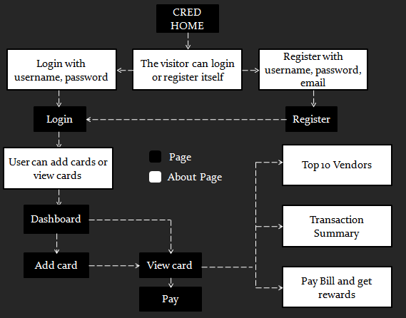

# CRED-T7
Team ID: CRED-T7 | Team Members: Aditya Mahajan &amp; Shantanu Singh

## Tech Stack
### Frontend

<p align="left">
    
</p>

### Backend
<p align="left">
   
</p>

### Database
<p align="left">
 
</p>

## Credit Card Management System
Built a <a href="https://cred.club/">CRED</a> app Clone with the following features

<ol>
<li>Login/Register :heavy_check_mark:</li> 
<li>Adding Cards :credit_card:</li> 
<li>View Card Statements :receipt:</li> 
<li>Smart Statements containing insights about different categorical features and top 10 vendors for a card :chart:</li>  
<li>Pay bill :heavy_dollar_sign:</li> 
<li>Send reminders for payments :envelope_with_arrow:</li> 
<li>Get rewards in form of coins for timely payments :moneybag: </li> 
</ol>

## Getting started 

### Softwares Required

For using this api you have to install following softwares
1. [Python](https://www.python.org/)
2. [VSCode](https://code.visualstudio.com/)-You can use any other editor
3. [Postman](https://www.postman.com/)- If you do not have experience with frontend technologies you can use postman just to check whether our API is working fine or not.
4. [Postgres](https://www.postgresql.org/)- We used Postgres Database, you can use any other Relational Database.
5. [pgadmin](https://www.pgadmin.org/)- It is a Database Management system for postgres.
6. [Node.js](https://nodejs.org/en/download/)- For installing React and Redux

### Libraries Required
Use below code to install python related dependencies
```
pip install -r requirements.txt
```
Use below code to install Javascript related dependencies
```
cd frontend
npm run package.json
```

## Testing
```
python manage.py test
```

## Starting app 
### Backend 
 ```
 python manage.py runserver
 ```
 ### Frontend 
 ```
 cd frontend
 npm run dev
 ```

## Database schema


## UI Flow

  
